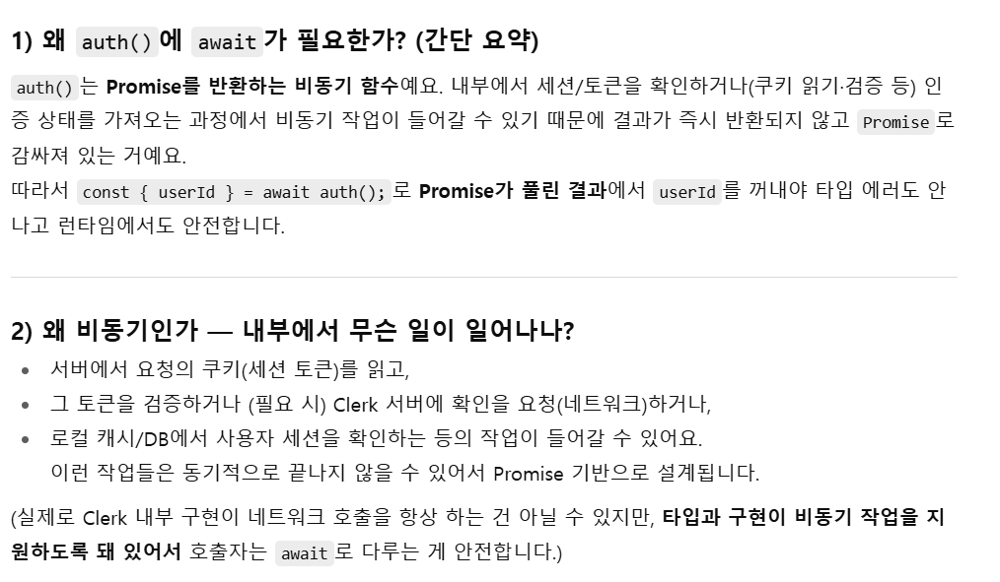

## Getting Started

First, run the development server:

```bash
npm run dev
# or
yarn dev
# or
pnpm dev
# or
bun dev
```

## Next로 만드는 블로그 구현순서
1. 메인화면 및 블로그 글 추가삭제 자세히 보기 등 라우팅 주소 구현 및 구조 설정
2. Clerk으로 로그인 시스템 구현(clerk 안에서 OAuth소셜로그인 지원)
3. 사용자 개인화 및 DB 구조설계 및 연동
4. DB 온라인화 및 OpenAI 기술을 활용한 차별화
5. TailwindCSS or Styled-Components 활용한 디자인 (Three.js 활용한 로고)
6. SEO 성능 최적화 및 CI/CD 및 테스트코드 활용


## Next.js에 대한 모든 것

### Image
Next.js의 Image 컴포넌트는 표준 HTML  태그를 확장한 것으로, 이미지를 자동으로 최적화  
이 컴포넌트는 서버 사이드에서 자동으로 이미지 크기를 조정하고, 최적의 포맷을 선택하여 불필요한 데이터 전송을 줄임   
lazy loading이 기본 설정되어 있어 뷰포트에서 벗어난 이미지는 사용자가 스크롤하여 해당 이미지가 필요할 때까지 로드되지 않음. 이러한 기능은 특히 대용량 이미지가 많은 사이트에서 페이지 로드 시간을 크게 단축시킴  

필수 속성 : width, height, alt

### 라우팅
Next.js 라우팅은 폴더,파일구조로 간단하게 만들 수 있다.(예전엔 page 라우터 요즘은 app 라우터)
파일 기반 라우팅을 지원하고 동적 라우팅의 경우 파일명, 폴더명을 []로 감싸주면 된다.  

#### 라우팅 하는법
<a href="/">Home</a> 
순수 HTML 요소로, 페이지는 완전히 새로고침  
페이지를 완전히 새로고침하므로 아래의 <Link> 태그를 사용하는 것이 좋다!  

<Link href="/posts/new">
  <button className="~">글 추가</button>
</Link>
페이지 컴포넌트 간의 연결을 위해 사용  
a 태그를 생성하여 웹 사이트가 크롤링될 수 있고 따라서 SEO에 적합하다.  
페이지를 다시 로드하지 않고 SPA가 동작하는 것처럼 보이게 만든다.  
JS가 로드된 상태에서 선택된 페이지에 필요한 내용만 추가적으로 가져온다.  

#### useRouter 훅 사용
Next.js는 프로그래밍 방식으로 탐색하기 위해 useRouter 훅을 제공한다.  
이는 사용자를 특정 동작 (예: 폼 제출)에 따라 다른 라우트로 리디렉션하고자 할 때 유용하다.  

useRouter 훅은 'router' 객체를 반환하며, 여러 가지 유용한 속성과 메서드를 포함한다.  
'router' 객체의 'push' 메서드를 사용하면 다른 페이지로 이동할 가능

예를 들어, 아래에서 Go Home 버튼을 누르면 홈 페이지로 돌아감  
```tsx
import { useRouter } from 'next/router'

function NavigationButton() {
  const router = useRouter()

  const goToHomePage = () => {
    router.push('/')
  }

  return (
    <button onClick={goToHomePage}>
      Go Home
    </button>
  )
}

export default NavigationButton
```

### API route


---

### Clerk 사용하여 로그인 사용자인증 하기
#### Clerk 세팅
```bash
npm install @clerk/nextjs
```
라이브러리 설치

middleware.ts 추가 
```tsx
import { authMiddleware } from "@clerk/nextjs";

export default authMiddleware();

export const config = {
  matcher: ["/((?!.*\\..*|_next).*)", "/"], // 보호할 경로
};
```

app/layout.tsx 수정
```tsx
import { ClerkProvider } from "@clerk/nextjs";

export default function RootLayout({ children }: { children: React.ReactNode }) {
  return (
    <ClerkProvider>
      <html lang="en">
        <body>{children}</body>
      </html>
    </ClerkProvider>
  );
}
```

#### 로그인 회원가입 페이지 구현
Nav 바 안에 Clerk 내장컴포넌트 사용
```tsx
<nav className="space-x-4 bg-blue-400">
              <a href="/">Home</a>
              <a href="/posts">Posts</a>
              <SignedIn>
                <UserButton />
              </SignedIn>
              <SignedOut>
                <SignInButton>
                  <span className="cursor-pointer">Sign In</span>
                </SignInButton>
                <SignUpButton>
                  <span className="cursor-pointer">Sign Up</span>
                </SignUpButton>
              </SignedOut>
            </nav>
```
#### Clerk 대시보드에서 webhooks 통한 DB 동기화 
Prisma ORM(Object Relational Mapper) 라이브러리 사용 DB 조작  

##### prisma 설치 및 초기화
```bash
npm install prisma @prisma/client
npx prisma init
```
모델 정의 후 마이그레이션 명령으로 실제 DB테이블 생성 //이부분부터 다시시작
```prisma
model user_tb {
  id        String   @id @default(uuid())
  clerkId   String   @unique
  email     String
  name      String?
  createdAt DateTime @default(now())
}
```
```bash
npx prisma migrate dev --name init
```
##### clerk대쉬보드에서 endpoint 설정 후 route 설정
 파일구조대로 라운팅되는 Next.js 를 이해하고 http://localhost:3000/api/clerk-webhook 엔드포인트설정


clerk-webhook 폴더에 route.ts 파일
```tsx
import { NextResponse } from "next/server";
import { PrismaClient } from "@prisma/client";

const prisma = new PrismaClient();

export async function POST(req: Request) {
  const body = await req.json();

  // 실제 들어오는 데이터 구조 확인
  console.log(JSON.stringify(body, null, 2));

  // Clerk에서 오는 user.created 이벤트 데이터 예시
  const { id, email_addresses, first_name, last_name } = body.data;

  await prisma.user_tb.create({
    data: {
      clerkId: id,
      email: email_addresses?.[0]?.email_address ?? "",
      name: [first_name, last_name].filter(Boolean).join(" "),
    },
  });

  return NextResponse.json({ ok: true });
}
```
<b>문제점</b>  
webhook으로 endpoint는 정상적으로 호출하고 있는 것 같으나 자꾸 실패가 뜸  
로컬로 접근하고있었는데 clerk 시스템에서 내 로컬에 접근을 못하고있었음 
<b>해결법</b>  
로컬을 외부로 열어주는 ngrok 이용 clerk이 이용할 수 있게 만듬  
 
 웹에서 회원가입 후 토큰 생성 다음 터미널에 적용
 ```bash
 npm i -g ngrok
 ngrok config add-authtoken $YOUR_AUTHTOKEN
 ngrok http 3000
 ``` 
 clerk에서 내 로컬에 접속하려면 ngrok 터미널을 실행시켜둔 채로 해야된다.

<b>문제점</b>  
prisma/client가 생성되지 않았다고 난리를 침 나는 분명히 생성을 했는데  
migrate 하면 자동설치 된다. 안되면 npm i @prisma/client 해주면됨  
그리고 npx prisma generate 이 명령으로 수동실행 가능
<b>해결법</b>  

schema.prisma 에서 output 경로 설정때문에 client가 다른 위치로 생성되어  
import { PrismaClient } from "@prisma/client"; 으로 경로를 못 찾았던 거라  
output 경로를 제거해주고 npx prisma generate 다시해준다.  
```jsx
generator client {
  provider = "prisma-client-js"
  // output   = "../src/generated/prisma"
}
```

<b>문제점</b>  
DB생성은 정작적으로 되는데 clerk 시스템적으로 user.created 하나만 구독해도 회원이 생기면 session.created 이벤트도 같이 발생해서 DB값 중복 저장됨
<b>해결법</b>  
라우터에서 값을 삽입하기 전 event.type을 받고 넣으면 된다.  

```tsx
if (body.type === "user.created") 
```

createdAt 필드가 UTC 로 저장되어 있을때 DB에서 프런트/백엔드로 값을 보여줄때  
KST로 변환해서 보여주면 된다. 

#### 로그인 상태 이용(글추가 기능은 로그인이 되어 있을때만 가능하게)

auth 함수를 사용하기 전에 어떻게 동작하는지 알아두면 좋다.  


clerk의 auth() 를 사용할때 서버 컴포넌트인지 클라이언트 컴포넌트인지가 중요하다.  
👉 서버에서 auth() = 비동기 → async/await 필요  
👉 클라이언트에서 auth() 못 씀 → 대신 useAuth() 동기 사용  

--- 
step1  
글 추가에서 카테고리 추가  
mypage에 나의 인포가 나오게 수정 
글 테이블 추가 및 사용자 DB랑 외래키 연결 
+일반 회원가입 사용자랑 소셜로그인 사용자 다 DB에 일괄저장할 수 있도록 DB구현  
일반 로그인도 시도하고 규격 일치한지 확인 완료  
글추가 post_tb 삽입 정상적으로 작동 & 외래키 관계 잘 적용

clerk에서 내 로컬에 접속하려면 ngrok 터미널을 실행시켜둔 채로 해야된다!  
```bash
ngrok http 3000  
```
DB 굳이 키지않고 prisma studio로 자세히 확인 가능  
```bash
npx prisma studio
```


---
post 게시글 mypage에서 나의 글 볼 수 있게 구현 및 수정 삭제 기능 추가  
comment_tb 추가하여 게시글에 댓글 기능 추가 (본인 댓글만 삭제 가능)  
---

이제 디자인 
디자인 전에 three.js 로 로고 제작!
다음엔 블로그 디자인 
 shadcn/ui (최고의 최신 UI 라이브러리) 사용 및 tailwind CSS 감각 키우기!!!

 로고디자인 살짝 해둘껏!!!
